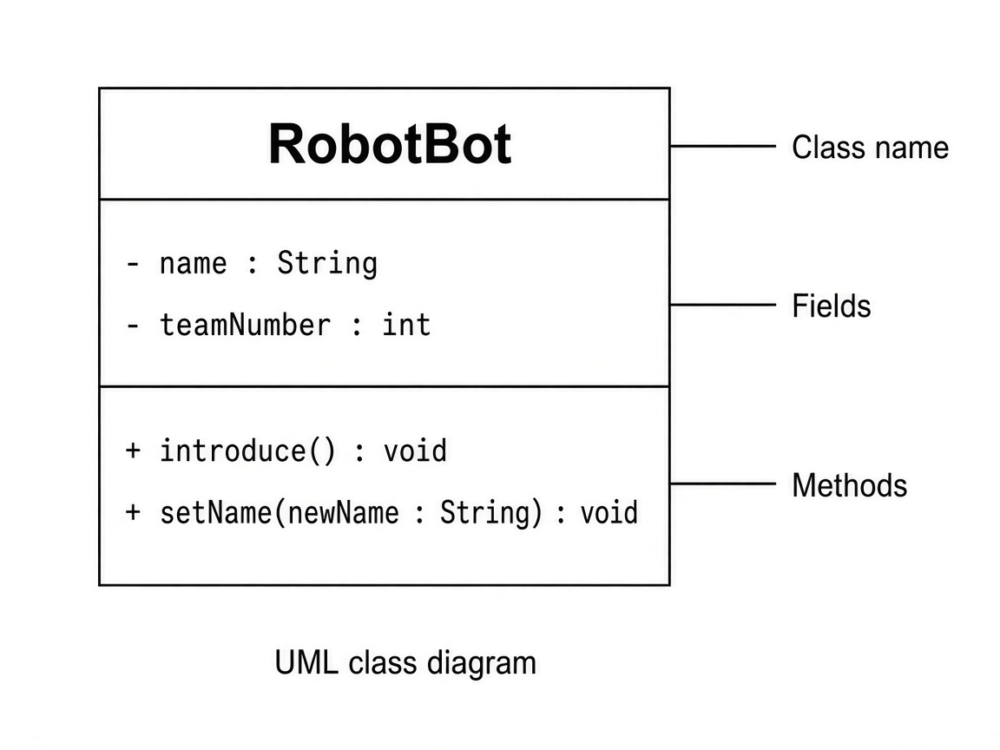

# Lesson 7: Classes and Objects

Goal: Understand what a class is, create an object with `new`, store data in fields, and use constructors, getters, and instance methods.

Time: About 40-50 minutes

## You will learn

- A **class** is the blueprint; an **object** is one instance built from that blueprint
- How to declare **fields** (data stored in each object)
- Why fields are often **private**, and how **getters** (and setters) let other code use that data safely
- How to write a **constructor** so `new Game(...)` sets up the object
- How to write **instance methods** (not `static`) and call them with `object.method()`
- How `toString()` helps you print an object

Before this lesson: Lessons 1-6 (especially methods and variables). You already typed `public class Main` as required setup - now you learn what a class is for.

## Why this matters for robots

Your FRC project is full of objects: a `DriveTrain`, a `Shooter`, a `Dashboard`. Each one keeps its own data (speed, position) and offers methods (`drive`, `shoot`). This lesson is the Java idea behind those robot pieces.

## The big idea

You have already used classes like `String` (where `"Java"` is one object). Now you will build a custom class from scratch.

## UML Class Diagrams

UML (Unified Modeling Language) class diagrams are a standard way to sketch a class before coding. A class box has three parts:

- Top: class name
- Middle: fields (data)
- Bottom: methods (behaviors)

Visibility markers: `+` means public, `-` means private.

Here is a UML class diagram for the `RobotBot` example you will see next. Notice the three boxes stacked in one rectangle, and the `-` / `+` visibility marks:



## A tiny class: `RobotBot`

Keep this in `RobotBot.java`. The file name must match the class name (Lesson 1 rule).

```java
public class RobotBot {
    String name;
    int teamNumber;

    public void introduce() {
        System.out.println("I am " + name + ", team " + teamNumber);
    }

    public void setName(String newName) {
        name = newName;
    }
}
```

- `name` and `teamNumber` are **fields** (variables that belong to each object)
- `introduce` and `setName` are **instance methods** - they are not `static`, so they need an object to run

## Creating an object with `new`

In `Main.java`:

```java
public class Main {
    public static void main(String[] args) {
        RobotBot bot = new RobotBot();
        bot.name = "Sparky";
        bot.teamNumber = 1038;
        bot.introduce();
    }
}
```

Output:

```
I am Sparky, team 1038
```

`new RobotBot()` creates one object. Dot notation reaches that object's fields and methods: `bot.name`, `bot.introduce()`.

## Private fields

If a field has no keyword (or is `public`), other classes can change it directly: `bot.name = "Sparky"`.

For real robot code, that is often too loose - any class could set a bad value. So we usually make fields **private**:

```java
private String name;
private int teamNumber;
```

Private means: only code **inside** `RobotBot` can read or write `name` and `teamNumber` directly. `Main` cannot do `bot.name = "Sparky"` anymore.

That is good for safety - but then `Main` needs an allowed way to read (and sometimes update) the data. That is what getters and setters are for.

## Getters

A **getter** is a public method that returns a private field's value. Naming style: `get` + FieldName with a capital letter.

```java
public class RobotBot {
    private String name;
    private int teamNumber;

    public String getName() {
        return name;
    }

    public int getTeamNumber() {
        return teamNumber;
    }
}
```

From `Main`:

```java
RobotBot bot = new RobotBot();
// after name/teamNumber are set somehow...
System.out.println(bot.getName());
System.out.println(bot.getTeamNumber());
```

Getters do not print by themselves - they **return** a value (Lesson 3). You can print the return value with `System.out.println`.

## Setters

A **setter** is a public method that updates a private field. Naming style: `set` + FieldName.

```java
public void setName(String newName) {
    name = newName;
}

public void setTeamNumber(int newTeamNumber) {
    teamNumber = newTeamNumber;
}
```

From `Main`:

```java
bot.setName("Sparky");
bot.setTeamNumber(1038);
```

You already saw `setName` earlier. Setters are optional on every class - use them when other code should be allowed to change the field after construction. Your Challenge `Game` class needs **getters**; you can skip setters on `Game` unless a challenge asks for them.

## Constructors

A **constructor** runs when you use `new`. It sets up the object.

Rules (remember these):

- The constructor name matches the class name exactly (`Game`, not `game`)
- No return type - not even `void`
- You can give it parameters, like a method

Example with parameters:

```java
public class RobotBot {
    private String name;
    private int teamNumber;

    public RobotBot(String name, int teamNumber) {
        this.name = name;
        this.teamNumber = teamNumber;
    }

    public String getName() {
        return name;
    }

    public int getTeamNumber() {
        return teamNumber;
    }
}
```

`this.name` means "the field named `name` on this object." The parameter is also called `name`, so `this.` tells Java which one you mean.

Create the object in one step:

```java
RobotBot bot = new RobotBot("Sparky", 1038);
System.out.println(bot.getName());
```

If you write **any** constructor, Java does not add an empty `new RobotBot()` for you unless you also write a no-arg constructor. Your challenges use the parameterized form: `new Game("Pokemon", 1996, "RPG")`.

## `toString`

Every object can define `toString()` to return a useful `String` description. When you print the object, Java often uses that string.

```java
@Override
public String toString() {
    return name + " (" + teamNumber + ")";
}
```

```java
System.out.println(bot.toString());
// or simply:
System.out.println(bot);
```

`@Override` tells Java you are replacing the default `toString`. Your challenge `toString` must include the game's name, year, and type (any readable format is fine as long as those values appear).

## `static` vs instance (just enough)

You have been writing `public static void main` and `public static int add`.

- `static` methods belong to the class and do not use one object's fields
- Instance methods (no `static`) run on one object and can use that object's fields

Robot subsystems almost always use instance methods: `shooter.run()`, `driveTrain.stop()`.

## More than one object

Each object has its own field values:

```java
RobotBot alpha = new RobotBot("Alpha", 1038);
RobotBot beta = new RobotBot("Beta", 254);

alpha.introduce();
beta.introduce();
```

Changing `beta` does not change `alpha`.

## Common mistakes

1. Forgetting `new` - `RobotBot bot;` does not create an object yet
2. Calling an instance method without an object - `introduce();` fails; use `bot.introduce();`
3. File / class name mismatch - `Game` must live in `Game.java`
4. Putting everything only in `Main` - the point is a second class that models a thing
5. Using `static` on instance methods by habit - then you cannot use instance fields the same way
6. Writing a return type on a constructor (`void Game(...)`) - that makes a normal method, not a constructor
7. Forgetting `return` in a getter
8. Trying `bot.name` from `Main` after making `name` private - use `bot.getName()` instead

## Try it yourself

> **Find your starter files:** In the file explorer, open the `src` folder, then `main`, then `java`. Edit the existing `Game.java` and `Main.java` there.
> Do **not** create new Java files at the top of the repo.

Edit `src/main/java/Game.java` and `src/main/java/Main.java` as described in the challenges.

Do **not** edit `src/test/java/GameTest.java` - that file checks your work automatically when you open a pull request.

### Challenge 1 - Fields, constructor, getters, toString

In `Game.java`, finish class `Game` with:

- Private fields: `name` (String), `year` (int), `type` (String)
- Constructor: `Game(String name, int year, String type)` that stores the three values (use `this.` if parameter names match the fields)
- Getters: `getName()`, `getYear()`, `getType()` that return each field
- `toString()` that returns a String including the name, year, and type

### Challenge 2 - play method

Add `public void play()` that prints a message containing the word `play` (for example `Playing Pokemon` or `Let's play!`).

### Challenge 3 - Two objects in main

In `Main`:

1. `Game pokemon = new Game("Pokemon", 1996, "RPG");`
2. `Game spaceball = new Game("Spaceball", 1986, "Pinball");`
3. Print pokemon's name, year, and type using the getters (and `System.out.println`)
4. Print `spaceball.toString()` (or print `spaceball`)
5. Call `play()` on both

## Check your understanding

1. <details>
     <summary>What is the difference between a class and an object?</summary>
     Class = blueprint; object = one instance built from it.
   </details>
2. <details>
     <summary>Why make a field private and write a getter?</summary>
     Private keeps other classes from changing the field directly. A getter lets them read the value in a controlled way.
   </details>
3. <details>
     <summary>What does `new Game("Pokemon", 1996, "RPG")` do?</summary>
     It creates a Game object and runs the constructor to store those three values.
   </details>
4. <details>
     <summary>Why does `bot.introduce()` need `bot.` in front?</summary>
     `introduce` is an instance method - it runs on a specific object.
   </details>
5. <details>
     <summary>If you have two Game objects, do they share the same name field?</summary>
     No. Each object has its own name, year, and type.
   </details>

## Looking ahead

In Lesson 8, you will practice more constructor patterns (`this`, overloading more than one constructor) on a new class.

Lesson complete. When you can write a small class with private fields, a constructor, getters, and instance methods, you are ready for Lesson 8.
